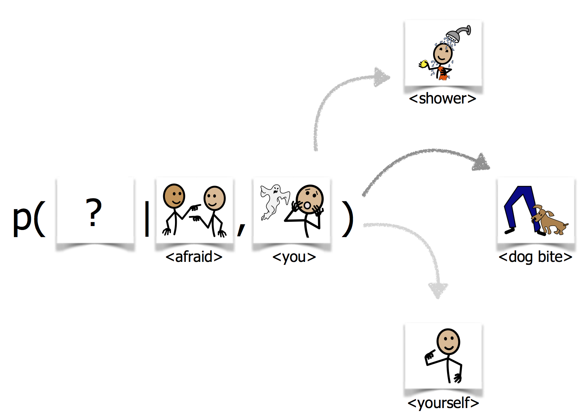

# Icon Languange Modeling Project
This project generates icon language models from corpus-less icon set. This projects provides the code used for the process and experiments described in [*Compositional Language Modeling for Icon-Based Augmentative and Alternative Communication*](http://www.aclweb.org/anthology/W18-3404) written by Dudy and Bedrick. In the paper you can find more details about the motivation and the context for this research.

```@inproceedings{dudy-bedrick-2018-compositional,
    title = "Compositional Language Modeling for Icon-Based Augmentative and Alternative Communication",
    author = "Dudy, Shiran  and
      Bedrick, Steven",
    booktitle = "Proceedings of the Workshop on Deep Learning Approaches for Low-Resource {NLP}",
    month = jul,
    year = "2018",
    address = "Melbourne",
    publisher = "Association for Computational Linguistics",
    url = "https://www.aclweb.org/anthology/W18-3404",
    doi = "10.18653/v1/W18-3404",
    pages = "25--32"
}
```

The code was written by Shiran Dudy.

Additional requirements to run the code are:
  * python3
  * [nltk for python](http://www.nltk.org)
  * An icons' meta data file. Each icon should have its name and synonyms associated with it in the file. Here, I assume the XML file is the icons metadata file of [Symbolstix](https://www.n2y.com/symbolstix-prime/).
  * A corpus that contains textual sentences in which the icons (name/synonyms) are found.
  * A pretrained word embedding set. The icon terms (mainly the synonym should be represented in this set).

Optional, but recommended is to follow the *fast version* of the process (fond in the appropriate folder). There you will be required to have 
 * [slurm scheduler](https://slurm.schedmd.com)
 * gpus
  
 The *dataprep* part of the code generates the simulated icon corpus. This part requires slurm for the *fast\_version*.
 
 The *modeling* part trains and tests the icon language models. This part requires slurm and gpu for the *fast\_version*
 
 The modeling part can be replaced by any alternative language modeling learning method. I slightly modified the basic approach borrowed from [word langauge modeling](https://github.com/pytorch/examples/tree/master/word_language_model) and adapted it to large vocabularies using [nce](https://github.com/Stonesjtu/Pytorch-NCE).
 
<p align="center">

</p>
