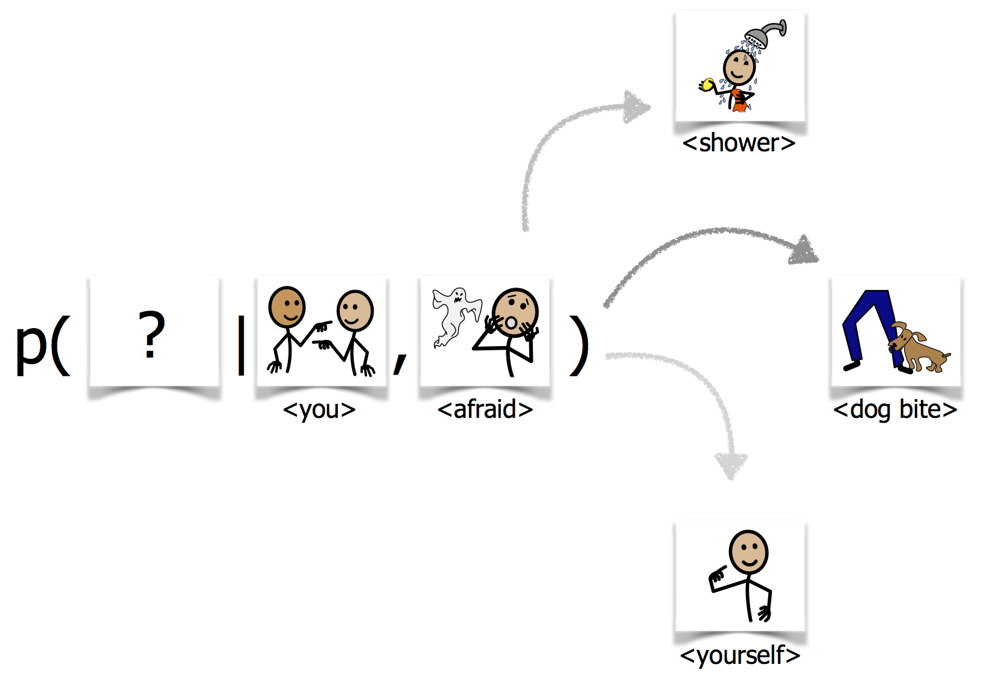

# icon_lm
This project generates icon language models from corpus-less icon set. This projects provides the code used for the process and experiments described in [*Compositional Language Modeling for Icon-Based Augmentative and Alternative Communication*](http://www.aclweb.org/anthology/W18-3404) written by Dudy and Bedrick. In the paper you can find more details about the motivation and the context for this research.

The code was written by Dudy.

Additional requirements to run the code are:
  * python3
  * [nltk for python](http://www.nltk.org)
  * An icons' meta data file. Each icon should have its name and synonyms associated with it in the file (here I assume its an XML file). We have used [Symboltix](https://www.n2y.com/symbolstix-prime/) icons metadata file.
  * A corpus that contains textual sentences in which the icons (name/synonyms) are found.
  * A pretrained word embedding set. The icon terms (mainly the synonym should be represented in this set).

Optional, but recommended is to follow the *fast version* of the process (fond in the appropriate folder). There you will be required to have 
 * [slurm scheduler](https://slurm.schedmd.com)
 * gpus
 
 The *dataprep* part of the code generates the simulated icon corpus
 
 The *modeling* part trains and tests the icon language models.
 

