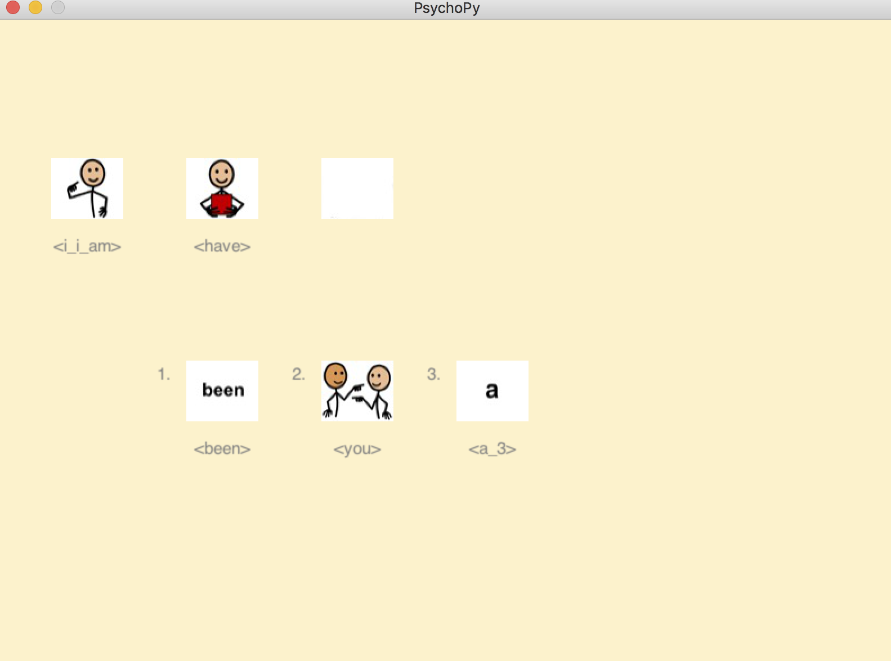

# Icon Languange Modeling regular version
Notice that there are the *demo.py* and *display.py* that will enable you to textually or visually inquire your model.

Additional requirements to run the display are:
  * psychopy
  * pdf2image
  * access to the images of symbolstix (pdf realization of them)
  
Using the display script, after providing your query you can type [1,2,3] (on your keyboard) to choose from the language model predictions to add to the current query.

